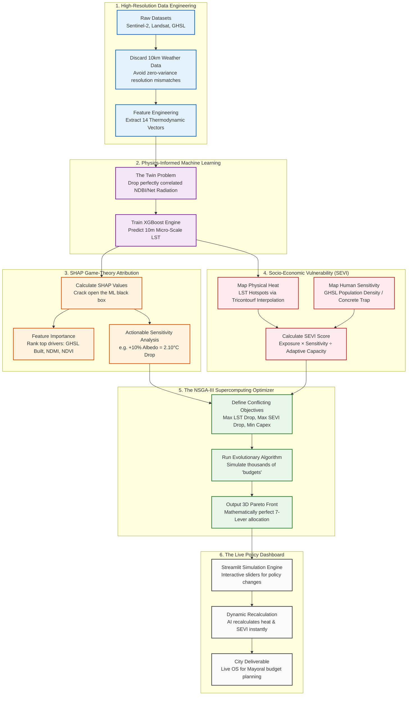

# 🏗️ The 7-Lever Urban Heat Mitigation Workflow

This document provides a highly detailed, chronological roadmap of the entire AI-driven Urban Heat Mitigation pipeline we built for Ahmedabad. It maps the journey from raw satellite data to a live policy optimization engine.

## 🗺️ Master Architecture Flowchart

---

## 📖 Deep-Dive Explanations

### 1. High-Resolution Data Engineering
Instead of using basic 2D maps, we engineered the physical thermodynamics of the city. We explicitly threw out low-resolution background pollution metrics (NO2, PM2.5) because a 10km pixel provides no micro-spatial variance. Instead, we used GHSL Population Density as a high-resolution proxy for anthropogenic waste heat. We extracted complex indices like **NDMI** (Latent Heat of Moisture) and injected **Exponential Decay Functions** to mathematically model advection (the cooling breeze from a park spilling into the neighborhood).

### 2. Physics-Informed Machine Learning (XGBoost)
We fed these 14 physical vectors into an XGBoost model to predict Land Surface Temperature (LST). During this phase, we solved the "Twin Problem" by explicitly dropping features with perfect negative multicollinearity (like NDBI and Net Radiation). This forced the ML model to be mathematically honest, attributing exactly 100% of the evaporative credit to the correct physical feature, rather than splitting it among redundant columns.

### 3. SHAP Game-Theory Attribution
We didn't just want a black-box prediction; we needed to know *why*. We used TreeSHAP to isolate the temperature contribution of every physical feature. This generated:
*   **Feature Importance Rankings:** Proving that Built Surface volume is the single biggest driver of heat.
*   **Sensitivity Analyses:** We calculated the exact, actionable slope for interventions, mathematically proving that a 10% absolute increase in Albedo directly yields a 2.10°C drop in Land Surface Temperature.

### 4. Socio-Economic Vulnerability (SEVI)
We realized that cooling empty concrete isn't the primary goal—saving human lives is. We calculated SEVI to map the divergence between physical heat (LST) and human vulnerability. 
*   **The Physical Mapping:** We used Triangular Contour Interpolation (`tricontourf`) to flawlessly map the heat gradient, mathematically bridging the artificial gap over the Sabarmati river.
*   **The Vulnerability Score:** By multiplying the LST by the extreme population density of the Central Wards, we proved that the acute human risk sits squarely in the dense, low-income tenement housing zones, not just the hotter industrial zones.

### 5. The NSGA-III Supercomputing Optimizer
Because the city has a limited budget, a one-size-fits-all policy fails. We deployed an NSGA-III Multi-Objective Evolutionary Algorithm to optimize our **7-Lever Strategy**. The algorithm pitted three conflicting objectives against each other: maximizing LST reduction, maximizing SEVI reduction, and minimizing Capital Expenditure (Capex). It converged on a 3D Pareto Front, definitively proving that the city must use a hybrid approach: **White Roofs** in the hot industrial East, and highly-targeted **IoT Misting Hubs / Amrit Sarovars** in the hyper-dense, vulnerable Center.

### 6. The Live Policy Dashboard
We packaged this entire supercomputing backend into a live, interactive Streamlit OS. Instead of a static PDF, policymakers can use sliders to simulate increasing urban greening or mandating white roofs. The XGBoost model dynamically recalculates the physics in the background, rendering instantaneous 3D spatial maps and proving the exact temperature and SEVI drop achieved by their simulated budget.
