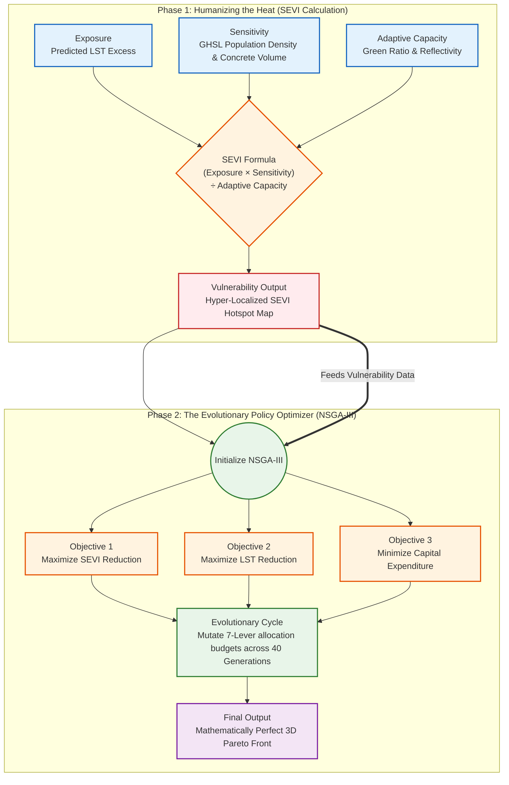

# 🧬 Deep-Dive Architecture: SEVI & NSGA-III Optimizer

This document provides a highly magnified look at the two most critical public policy engines in the Ahmedabad Urban Heat pipeline: The **Socio-Economic Vulnerability Index (SEVI)** and the **NSGA-III Evolutionary Optimizer**.

## 🗺️ The Optimization Flowchart

---

## 🔬 Component Breakdown

### Phase 1: SEVI (Socio-Economic Vulnerability Index)
The SEVI engine ensures the city isn't just cooling empty concrete, but actually saving lives. It mathematically intersects three physical realities:
1.  **Exposure:** Supplied directly by our XGBoost engine, this is the actual physical heat signature (LST Excess) of a 10m grid.
2.  **Sensitivity:** We use GHSL Population Density as a physical proxy for human bodies. If 1,000 people are trapped in a dense concrete grid, their thermodynamic sensitivity is mathematically scaled up due to extreme density and anthropogenic waste heat.
3.  **Adaptive Capacity:** This acts as the mathematical denominator. If a grid has high greenery or cooling infrastructure, the vulnerability is divided (reduced). 
*Result:* The engine outputs a heat map proving that human vulnerability peaks in the dense, central slums (e.g., Danilimda), not the absolute hottest industrial zones.

### Phase 2: NSGA-III (Non-dominated Sorting Genetic Algorithm III)
Policy making is a game of scarce resources. The NSGA-III algorithm is a supercomputing architecture that acts like natural selection to find the perfect budget allocation.
1.  **The Inputs:** It ingests the LST map and the SEVI map.
2.  **The Conflicting Objectives:** It tries to cool the city (Drop LST), save the humans (Drop SEVI), and save money (Minimize Capex) all at the exact same time. These three goals inherently conflict with each other.
3.  **The Evolution:** Over 40 generations, the AI mutates thousands of simulated "budgets" (e.g., testing what happens if it spends ₹50 Lakh on White Roofs in Vatva vs. IoT Misting in Gomtipur).
4.  **The 3D Pareto Front:** It converges on the absolute mathematically optimal strategy—a 3D curve where it is impossible to gain even 0.1°C more cooling without spending more money. This mathematically proves that a hybrid 7-Lever strategy is superior to a blanket one-size-fits-all policy.
